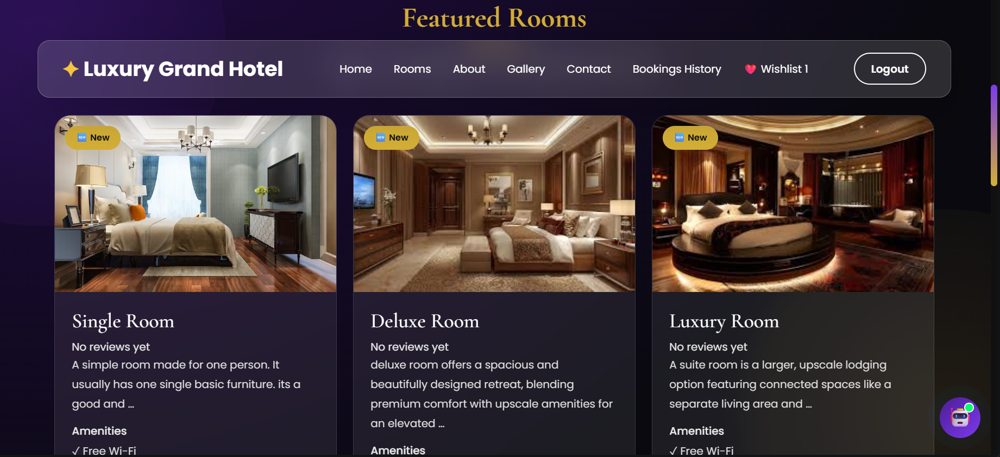
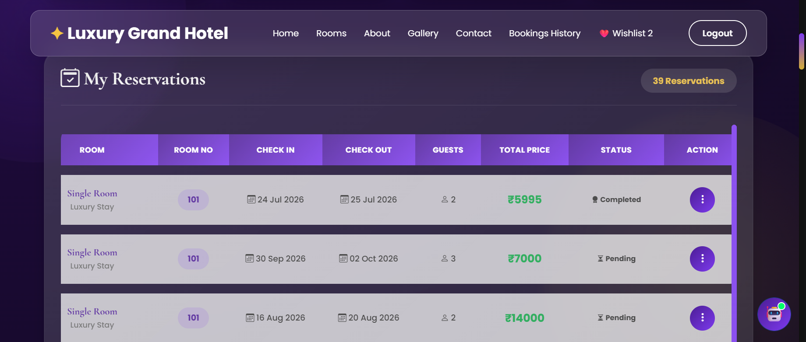

# 🏨 Luxury Grand Hotel

### Full-Stack Hotel Management & Booking System with Gemini AI

**Luxury Grand Hotel** is a full-stack hotel management and online booking web application developed using **Python and Django**, with a modern responsive frontend and an integrated **Gemini AI chatbot**.

The application provides a complete hotel booking experience for customers while also providing administrative tools for managing rooms, users, bookings, revenue, reports, notifications, and hotel settings.

---

## ✨ Project Overview

Luxury Grand Hotel is designed as a modern hotel management platform that combines:

* 🏨 Hotel room management
* 📅 Online room booking
* 👤 User authentication
* ❤️ Wishlist management
* ⭐ Reviews and ratings
* 🤖 Gemini AI-powered chatbot
* 📊 Admin dashboard and analytics
* 📈 Booking and revenue reports
* 📧 Email notifications
* 🧾 Booking invoice generation
* 📱 Responsive and premium user interface
* 🔐 Environment-based configuration for sensitive credentials

The project follows a full-stack architecture where **Django handles the backend, business logic, database operations, authentication, booking management, and administrative functionality**, while the frontend provides the user-facing hotel experience.

---

## 🚀 Key Features

### 👤 User Authentication

* User registration
* Secure login and logout
* Authentication-protected booking features
* User-specific booking history
* User-specific wishlist
* Profile-based booking management

### 🛏️ Room Management

* Multiple room categories
* Room pricing
* Room images
* Room availability management
* Room search and filtering
* Room-type filtering
* Price-range filtering
* Detailed room information

### 📅 Hotel Booking System

* Room booking
* Check-in and check-out dates
* Guest selection
* Automatic booking price calculation
* Room availability validation
* Booking conflict prevention
* Booking confirmation
* Booking history
* Modify booking
* Cancel booking
* Delete booking
* QR-code based booking information
* Downloadable booking invoice

### ❤️ Wishlist

* Add rooms to wishlist
* Remove rooms from wishlist
* User-specific wishlist management

### ⭐ Reviews & Ratings

* Submit hotel/booking reviews
* 1–5 star ratings
* Display room rating information
* Average rating calculation

### 🤖 Gemini AI Hotel Assistant

The application includes an integrated **Gemini AI chatbot** that acts as a virtual hotel assistant.

The chatbot can assist users with:

* Hotel-related questions
* Room information
* Booking conversations
* Room-type selection
* Booking details
* Guided booking flow
* Interactive responses

The chatbot is integrated into the Django application through a dedicated chatbot backend.

### 📊 Admin Dashboard

A dedicated custom admin dashboard provides management functionality for hotel administrators.

#### Dashboard

* Booking statistics
* Room statistics
* User statistics
* Revenue information
* Booking status overview

#### Room Management

* Add rooms
* Manage rooms
* Update room information
* Manage room availability
* Upload room images

#### Booking Management

* View bookings
* Monitor booking statuses
* Manage booking information
* Track booking activity

#### User Management

* View registered users
* Search users
* Monitor user statistics

#### Analytics & Reports

* Revenue analytics
* Booking analytics
* Monthly booking trends
* Completion and cancellation statistics
* Room availability statistics
* Room-type analysis
* Booking-status analysis
* Top-performing rooms

### 📧 Email Notifications

The application supports automated email notifications for relevant booking activities, including booking confirmation information and QR-code details.

### ⚙️ Admin Settings

The custom admin dashboard includes configurable sections for:

* Hotel Settings
* Notification Settings
* Security Settings
* Admin Profile

---

# 🛠️ Technology Stack

## Backend

* **Python**
* **Django**
* Django ORM
* Django Authentication
* Django Email Backend

## Frontend

* **HTML5**
* **CSS3**
* **JavaScript**
* **Bootstrap 5**
* **Bootstrap Icons**

## Artificial Intelligence

* **Google Gemini API**
* Gemini AI chatbot

## Database

* **SQLite** for development

## Additional Technologies

* QR Code generation
* SMTP email integration
* Environment variables
* Git & GitHub

---

# 🏗️ Application Architecture

```text
                    ┌──────────────────────────┐
                    │        Frontend          │
                    │                          │
                    │ HTML • CSS • JavaScript  │
                    │ Bootstrap • UI Components│
                    └────────────┬─────────────┘
                                 │
                                 ▼
                    ┌──────────────────────────┐
                    │      Django Backend      │
                    │                          │
                    │ Views • URLs • Forms     │
                    │ Authentication           │
                    │ Business Logic           │
                    └────────────┬─────────────┘
                                 │
                  ┌──────────────┼──────────────┐
                  ▼              ▼              ▼
          ┌────────────┐  ┌────────────┐  ┌────────────┐
          │  Database  │  │ Gemini AI  │  │   Email    │
          │   SQLite   │  │  Chatbot   │  │   SMTP     │
          └────────────┘  └────────────┘  └────────────┘
```

---

# 📁 Project Structure

```text
luxury-grand-hotel/
│
├── chatbot/
│   ├── templates/
│   ├── static/
│   ├── views.py
│   └── ...
│
├── hotel/
│   ├── migrations/
│   ├── templates/
│   ├── static/
│   ├── models.py
│   ├── views.py
│   ├── forms.py
│   ├── urls.py
│   └── ...
│
├── hotel_booking/
│   ├── settings.py
│   ├── urls.py
│   ├── wsgi.py
│   └── ...
│
├── static/
│
├── templates/
│
├── manage.py
├── .gitignore
└── README.md
```

---

# 🔐 Security & Configuration

Sensitive credentials are managed through environment variables rather than being stored directly in the source code.

Examples include:

```text
SECRET_KEY
GEMINI_API_KEY
EMAIL_HOST_USER
EMAIL_HOST_PASSWORD
RAZORPAY_KEY_ID
RAZORPAY_KEY_SECRET
```

The `.env` file is excluded from version control through `.gitignore`.

---

# ⚙️ Local Installation

## 1. Clone the repository

```bash
git clone <your-github-repository-url>
cd luxury-grand-hotel
```

## 2. Create a virtual environment

```bash
python -m venv venv
```

Activate it on Windows:

```powershell
venv\Scripts\activate
```

## 3. Install dependencies

```bash
pip install -r requirements.txt
```

## 4. Configure environment variables

Create a `.env` file in the project root and configure the required credentials.

Example:

```text
SECRET_KEY=your-secret-key
GEMINI_API_KEY=your-gemini-api-key
EMAIL_HOST_USER=your-email
EMAIL_HOST_PASSWORD=your-email-app-password
```

## 5. Apply database migrations

```bash
python manage.py migrate
```

## 6. Create an administrator account

```bash
python manage.py createsuperuser
```

## 7. Start the development server

```bash
python manage.py runserver
```

Then open the local Django development server in your browser.

---

# 🧪 Testing

The application has been tested across major functional areas including:

* User registration and authentication
* Room browsing and filtering
* Room availability
* Hotel booking
* Booking conflict validation
* Booking modification
* Booking cancellation
* Booking deletion
* Booking history
* Wishlist
* Reviews and ratings
* QR-code generation
* Email notifications
* Admin dashboard
* Room management
* User management
* Booking management
* Analytics and reports
* Admin settings
* Gemini AI chatbot
* AI-assisted booking workflow

---

# 📈 Current Development Status

### Completed

* ✅ Authentication
* ✅ Room Management
* ✅ Room Search & Filtering
* ✅ Booking System
* ✅ Booking Availability Validation
* ✅ Booking History
* ✅ Modify Booking
* ✅ Cancel Booking
* ✅ Delete Booking
* ✅ Wishlist
* ✅ Reviews & Ratings
* ✅ QR Code Booking
* ✅ Invoice Generation
* ✅ Admin Dashboard
* ✅ Admin Room Management
* ✅ Admin User Management
* ✅ Admin Booking Management
* ✅ Analytics & Reports
* ✅ Email Notifications
* ✅ Admin Settings
* ✅ Gemini AI Chatbot
* ✅ AI Booking Workflow
* ✅ GitHub Repository Setup

### Under Development / Planned

* 🔄 Razorpay payment integration refinement
* 🔄 Production deployment
* 🔄 Final security hardening
* 🔄 Responsive UI refinement
* 🔄 Final performance and validation improvements

---

# 💳 Payment Integration

The project includes Razorpay payment integration code for online payment processing.

The payment functionality is currently **under development/testing** and is not represented as a fully production-ready payment system.

---

# 🎯 Project Goals

The main goals of this project are to demonstrate practical full-stack development skills through a real-world hotel management application.

The project focuses on:

* Backend development with Django
* Database-driven web applications
* REST/API-based AI integration
* Authentication and authorization
* Business logic implementation
* Booking and availability management
* Administrative dashboards
* Data analytics
* Email automation
* Modern responsive UI development
* Secure environment configuration

---

# 🔮 Future Enhancements

Possible future improvements include:

* Production deployment
* PostgreSQL database
* Cloud media storage
* Advanced payment processing
* Advanced hotel analytics
* Multi-hotel support
* Online check-in/check-out
* Automated booking reminders
* Advanced AI hotel recommendations
* Real-time notifications
* Improved accessibility and performance

---

# 👩‍💻 Author

**Sahana Sannati**

Computer Science and Design

---

## ⭐ Project Highlights

> A complete full-stack hotel management platform combining **Django backend development, modern frontend design, database management, AI integration, booking workflows, administrative analytics, and automated communication** in a single real-world web application.

---

## Screenshots

### Home Page


### Rooms & Search




### Booking Details




### Gemini AI Chatbot


### Admin Dashboard


### Analytics & Reports


## 📌 Repository

This repository contains the source code and development documentation for the **Luxury Grand Hotel** full-stack web application.
