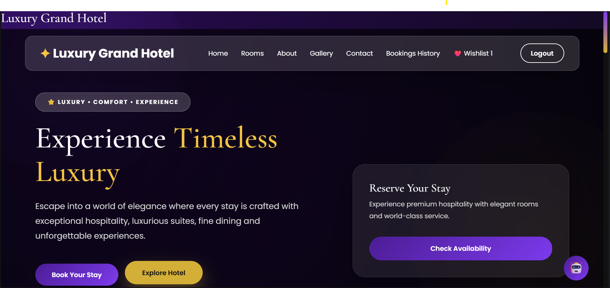
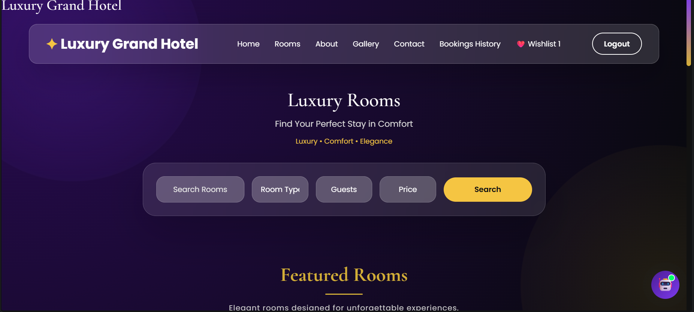
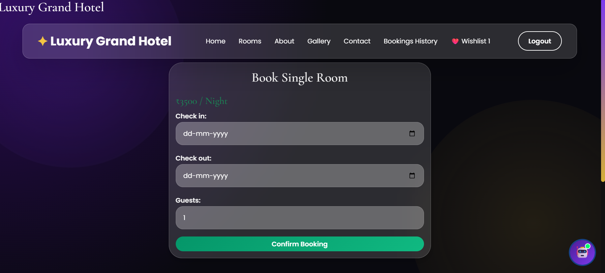
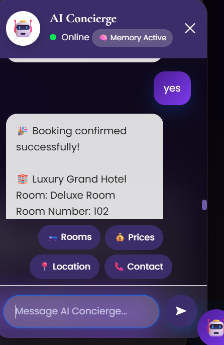
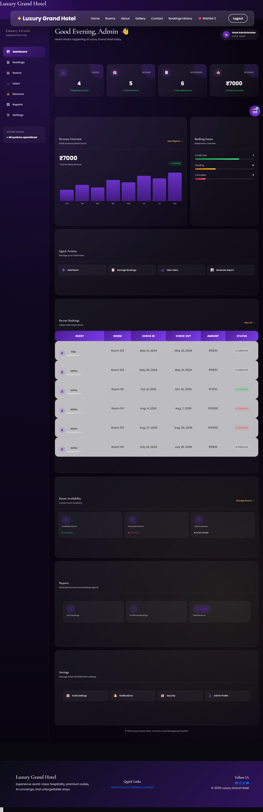
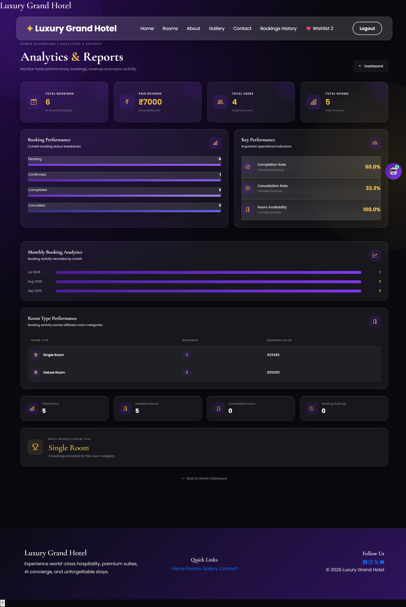

# 🏨 Luxury Grand Hotel

### Full-Stack Hotel Management & Booking Platform with Gemini AI

> **Luxury Grand Hotel** is a full-stack hotel management and booking platform built with **Python, Django, JavaScript, Bootstrap, SQLite, and Google Gemini AI**. It combines a premium guest experience with a custom administrative system for managing rooms, bookings, users, analytics, and hotel operations.

---

## ✨ Project Overview

Luxury Grand Hotel is a **database-driven full-stack web application** designed to simulate the digital operations of a modern hotel.

The platform provides separate experiences for **guests and administrators**:

* Guests can discover rooms, search and filter available rooms, make and manage bookings, maintain a wishlist, submit reviews, view booking history, and interact with an AI-powered hotel assistant.
* Administrators can manage rooms, bookings, users, hotel configuration, notifications, and operational analytics through a dedicated custom dashboard.

The project focuses not only on UI development, but also on **backend business logic, database relationships, authentication, authorization, booking validation, AI integration, automated communication, and administrative workflows**.

---

# 🚀 Key Features

### 👤 Authentication & User Management

* User registration and login
* Secure logout
* Authentication-protected features
* User-specific bookings
* User-specific wishlist
* Protected booking operations
* Role-aware administrative access

### 🛏️ Room Management

* Dynamic room catalogue
* Multiple room categories
* Room images
* Room descriptions
* Room numbers
* Dynamic pricing
* Availability status
* Room detail pages
* Search and filtering

### 🔎 Search & Filtering

Guests can find rooms using:

* Keyword search
* Room-type filters
* Price-range filters
* Availability information
* Rating information

### 📅 Booking Management

The booking system supports:

* Check-in and check-out dates
* Guest selection
* Automatic stay-duration calculation
* Automatic total-price calculation
* Booking creation
* Booking modification
* Booking cancellation
* Booking history
* Booking status tracking
* QR-code booking information

### ❤️ Wishlist

Users can:

* Add rooms to their wishlist
* Remove saved rooms
* View saved rooms
* Maintain a personal wishlist across sessions

The database design prevents duplicate wishlist entries for the same user and room.

### ⭐ Reviews & Ratings

The application includes a booking-linked review system with:

* 1–5 star ratings
* Written reviews
* Room rating display
* Average rating calculation
* Rating count
* Review eligibility based on completed stays

---

# 🤖 Gemini AI Hotel Assistant

One of the major features of Luxury Grand Hotel is its integrated **Gemini AI hotel assistant**.

Instead of treating AI as a separate demonstration, the chatbot is integrated directly into the hotel application.

### AI assistant capabilities

* Hotel-related assistance
* Room information
* Room guidance
* Booking assistance
* Conversational interaction
* Context-aware responses
* Client-side conversation history

### Architecture

```text
Guest
  ↓
Chatbot Interface
  ↓
Django Chatbot Endpoint
  ↓
Google Gemini API
  ↓
AI Response
  ↓
Guest
```

The chatbot provides an interactive concierge-style experience while remaining part of the main hotel application.

---

# 🏢 Custom Admin Dashboard

The project includes a **custom-built administrative dashboard** rather than relying only on Django's default admin interface.

### Dashboard modules

```text
Admin Dashboard
│
├── Dashboard
├── Bookings
├── Rooms
├── Users
├── Revenue
├── Reports
└── Settings
```

### Administrative capabilities

* Room management
* Booking management
* User management
* Booking statistics
* Revenue information
* Operational reports
* Hotel settings
* Notification settings
* Security settings
* Admin profile management

---

# 🛏️ Admin Room Management

Administrators can manage hotel inventory through a dedicated interface.

### Includes

* Add rooms
* Edit rooms
* Delete rooms
* Room number management
* Room-type management
* Price management
* Description management
* Image upload
* Availability management
* Search
* Room-type filtering
* Availability filtering

---

# 📊 Analytics & Reports

The administrative dashboard provides operational insights into hotel activity.

### Reporting areas include

* Total bookings
* Pending bookings
* Confirmed bookings
* Completed bookings
* Cancelled bookings
* Revenue information
* Room availability
* Booking trends
* Completion statistics
* Cancellation statistics
* Room-type analysis
* Booking-status analysis
* Top room information
* User statistics

This transforms the application from a basic booking website into a more complete **hotel operations management system**.

---

# 🧠 Booking Business Logic

A key backend component is the room availability validation system.

Before creating a booking, the application checks whether the requested room and dates conflict with existing active reservations.

```text
Requested Booking
       │
       ▼
Check Room
       │
       ▼
Check Date Range
       │
       ▼
Find Overlapping Active Bookings
       │
       ├── Conflict → Reject Booking
       │
       └── No Conflict → Continue
```

The system considers relevant booking states when determining whether a room is already reserved.

This prevents overlapping reservations while allowing incomplete booking attempts to avoid permanently blocking room inventory.

---

# 🔄 Booking Lifecycle

Bookings are managed through defined states:

```text
Pending
   │
   ├── Confirmed
   │      │
   │      └── Completed
   │
   └── Cancelled
```

This state-based approach allows the application to distinguish between an upcoming reservation, a completed stay, and a cancelled booking.

---

# 📧 Email & QR Booking Communication

The application connects booking operations with automated communication.

After the relevant booking workflow is completed, users can receive booking information through email.

The system also generates **QR-code information associated with bookings**, providing a convenient digital representation of reservation details.

---

# 🎨 Premium Hospitality UI

The frontend was designed specifically for a **luxury hotel experience** rather than a generic CRUD application.

### Design direction

* Premium dark visual theme
* Gold-accented interactions
* Glassmorphism-inspired components
* Modern typography
* Responsive layouts
* Hotel-focused visual hierarchy
* Interactive navigation
* Premium room cards
* Custom booking interfaces
* Dedicated chatbot experience
* Separate guest and admin interfaces

The overall visual direction is inspired by the polished digital experiences associated with modern luxury hospitality brands.

---

# 🏗️ Application Architecture

```text
                         ┌──────────────────────┐
                         │   Guest / Admin UI   │
                         └──────────┬───────────┘
                                    │
                                    ▼
                         ┌──────────────────────┐
                         │    Frontend Layer    │
                         │                      │
                         │ HTML • CSS • JS      │
                         │ Bootstrap            │
                         └──────────┬───────────┘
                                    │
                                    ▼
                         ┌──────────────────────┐
                         │   Django Backend     │
                         │                      │
                         │ Views • URLs • Forms │
                         │ Authentication       │
                         │ Business Logic       │
                         └───────┬───────┬──────┘
                                 │       │
                    ┌────────────┘       └────────────┐
                    ▼                                 ▼
          ┌──────────────────┐              ┌──────────────────┐
          │     Database     │              │ External Services│
          │                  │              │                  │
          │ Django ORM       │              │ Gemini AI        │
          │ SQLite           │              │ SMTP Email       │
          │ Model Relations  │              │ QR Generation    │
          └──────────────────┘              └──────────────────┘
```

---

# 🛠️ Technology Stack

| Layer               | Technologies            |
| ------------------- | ----------------------- |
| **Backend**         | Python, Django          |
| **Frontend**        | HTML5, CSS3, JavaScript |
| **UI Framework**    | Bootstrap 5             |
| **Icons**           | Bootstrap Icons         |
| **AI**              | Google Gemini API       |
| **Database**        | SQLite                  |
| **ORM**             | Django ORM              |
| **Email**           | Django Email / SMTP     |
| **QR Generation**   | QR Code Library         |
| **Version Control** | Git, GitHub             |
| **Configuration**   | Environment Variables   |

---

# 📁 Project Structure

```text
luxury-grand-hotel/
│
├── chatbot/
│   ├── templates/
│   ├── static/
│   ├── views.py
│   └── ...
│
├── hotel/
│   ├── migrations/
│   ├── templates/
│   ├── static/
│   ├── models.py
│   ├── views.py
│   ├── forms.py
│   ├── urls.py
│   └── ...
│
├── hotel_booking/
│   ├── settings.py
│   ├── urls.py
│   ├── wsgi.py
│   └── ...
│
├── templates/
├── static/
├── screenshots/
│
├── manage.py
├── requirements.txt
├── .gitignore
└── README.md
```

---

# 🔐 Security & Configuration

The project uses environment-based configuration for sensitive credentials.

Example:

```env
SECRET_KEY=your-secret-key
GEMINI_API_KEY=your-gemini-api-key
EMAIL_HOST_USER=your-email
EMAIL_HOST_PASSWORD=your-email-app-password
```

Sensitive credentials should remain outside the source code and should never be committed to the public repository.

The application also uses authentication and staff-level access controls for administrative functionality.

---

# 🧪 Functional Testing

The application has been manually tested across its major workflows.

### Customer-side

* Registration
* Login/logout
* Room browsing
* Search
* Filtering
* Room availability
* Booking creation
* Booking validation
* Booking modification
* Booking cancellation
* Booking history
* Wishlist
* Reviews and ratings
* QR-code generation
* Email communication
* Gemini chatbot

### Admin-side

* Dashboard access
* Room management
* Booking management
* User management
* Analytics
* Reports
* Settings
* Staff-only access

---

# 📸 Application Screenshots

## 🏠 Home Page



## 🛏️ Rooms & Search



## 📅 Booking Details



## 🤖 Gemini AI Hotel Assistant



## 📊 Admin Dashboard



## 📈 Analytics & Reports



---

# ⚙️ Local Setup

### 1. Clone the repository

```bash
git clone https://github.com/sahanasannati04-dot/luxury-grand-hotel.git
cd luxury-grand-hotel
```

### 2. Create a virtual environment

```bash
python -m venv venv
```

### 3. Activate the environment

**Windows:**

```bash
venv\Scripts\activate
```

### 4. Install dependencies

```bash
pip install -r requirements.txt
```

### 5. Configure environment variables

Create a `.env` file and add the required application credentials.

### 6. Run migrations

```bash
python manage.py migrate
```

### 7. Create an admin account

```bash
python manage.py createsuperuser
```

### 8. Start the application

```bash
python manage.py runserver
```

---

# 📌 Project Highlights

| Area                       | Implementation                            |
| -------------------------- | ----------------------------------------- |
| **Full-Stack Development** | Django + HTML/CSS/JS + Bootstrap          |
| **Database Design**        | Relational Django models                  |
| **Booking System**         | Date-based reservation workflow           |
| **Business Logic**         | Room conflict and availability validation |
| **AI Integration**         | Google Gemini hotel assistant             |
| **Administration**         | Custom hotel management dashboard         |
| **Analytics**              | Booking and operational reporting         |
| **Communication**          | Automated email + QR booking information  |
| **Personalization**        | Wishlist + reviews and ratings            |
| **Security**               | Authentication + staff access control     |
| **Configuration**          | Environment-based credentials             |
| **Version Control**        | Git + GitHub                              |

---

# 🔮 Future Enhancements

Possible future improvements include:

* PostgreSQL database migration
* Production deployment
* Cloud-based media storage
* Advanced AI-powered recommendations
* Automated booking reminders
* Real-time notifications
* Multi-property hotel support
* Online check-in/check-out
* Additional performance optimization
* Further accessibility improvements

---

# 👩‍💻 Author

### Sahana Sannati

**Computer Science and Design | Full-Stack Developer**

**Sharnbasva University, Kalaburagi**

Passionate about building **full-stack web applications, AI-integrated solutions, and practical software products** using modern web technologies.

### 🔗 Connect

**GitHub:** [github.com/sahanasannati04-dot](https://github.com/sahanasannati04-dot)


---

## ⭐ Project Summary

**Luxury Grand Hotel** demonstrates how a real-world hospitality workflow can be transformed into a complete full-stack application by combining **Django backend development, database-driven booking logic, premium frontend design, AI integration, administrative operations, analytics, automated communication, and user-focused features**.

> **Built as a hands-on full-stack engineering project with a focus on practical application architecture, business logic, AI integration, and modern web development.**

---

### 🏷️ Tech Keywords

`Python` `Django` `JavaScript` `HTML5` `CSS3` `Bootstrap` `SQLite` `Gemini AI` `Django ORM` `SMTP` `QR Code` `Git` `GitHub`
